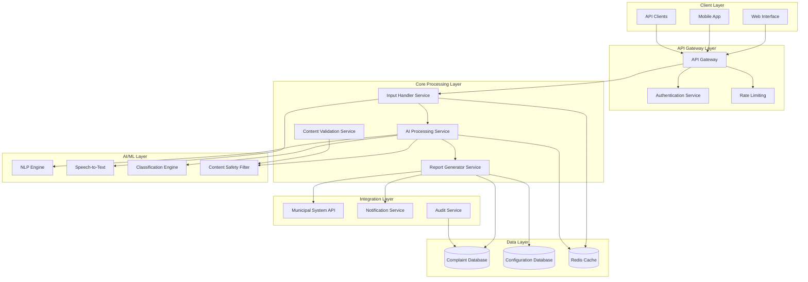
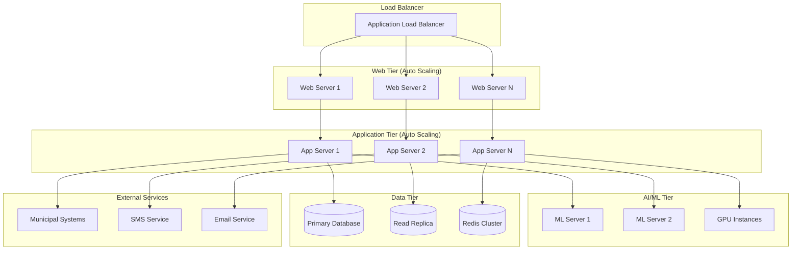
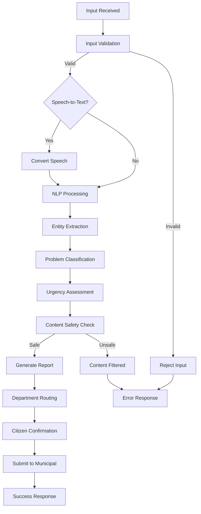

# Design Document: AI-Powered Civic Complaint System

## Overview

The AI-Powered Civic Complaint System is a multi-modal complaint processing platform that transforms citizen reports into structured, actionable civic reports. The system leverages natural language processing, speech recognition, and image analysis to handle diverse input types while maintaining professional standards and municipal integration capabilities.

The architecture follows a microservices pattern with clear separation between input processing, AI analysis, report generation, and external integrations. This design ensures scalability, maintainability, and easy integration with existing municipal systems.

## Architecture

### System Architecture Diagram



### Deployment Architecture



## Components and Interfaces

### Input Handler Service

**Responsibilities:**
- Process multi-modal inputs (text, voice, images)
- Perform initial input validation and sanitization
- Convert voice inputs to text using speech-to-text services
- Extract metadata from image inputs
- Queue inputs for AI processing

**Key Interfaces:**
```typescript
interface InputRequest {
  type: 'text' | 'voice' | 'image';
  content: string | Buffer;
  metadata: {
    timestamp: Date;
    location?: GeoLocation;
    citizenId?: string;
  };
}

interface ProcessedInput {
  id: string;
  textContent: string;
  inputType: InputType;
  metadata: InputMetadata;
  status: 'processed' | 'error';
}
```

### AI Processing Service

**Responsibilities:**
- Coordinate AI analysis pipeline
- Manage NLP processing for text understanding
- Invoke classification engines for problem categorization
- Determine urgency levels with reasoning
- Apply content safety filters

**Key Interfaces:**
```typescript
interface AIAnalysisRequest {
  inputId: string;
  textContent: string;
  metadata: InputMetadata;
}

interface AIAnalysisResult {
  problemType: ProblemType;
  urgencyLevel: UrgencyLevel;
  urgencyReasoning: string;
  contentSafetyScore: number;
  extractedEntities: Entity[];
  confidence: number;
}
```

### Classification Engine

**Responsibilities:**
- Categorize complaints into predefined problem types
- Assign urgency levels based on content analysis
- Provide reasoning for classification decisions
- Handle edge cases and ambiguous inputs

**Problem Type Categories:**
- Garbage/Sanitation
- Road Damage/Potholes
- Street Lights
- Water Supply/Drainage
- Traffic/Public Safety
- General Civic Issue

**Urgency Level Determination:**
- **High**: Safety-critical issues, infrastructure failures affecting public safety
- **Medium**: Issues affecting daily life, moderate infrastructure problems
- **Low**: Aesthetic issues, minor maintenance needs

### Report Generator Service

**Responsibilities:**
- Create structured official reports from AI analysis
- Format reports according to municipal standards
- Generate citizen confirmation messages
- Suggest appropriate municipal departments
- Maintain professional language standards

**Key Interfaces:**
```typescript
interface ReportGenerationRequest {
  analysisResult: AIAnalysisResult;
  originalInput: ProcessedInput;
}

interface StructuredReport {
  id: string;
  problemType: ProblemType;
  urgencyLevel: UrgencyLevel;
  urgencyReasoning: string;
  officialSummary: string; // 5-8 lines
  suggestedDepartment: string;
  citizenConfirmation: string;
  timestamp: Date;
}
```

### Content Validation Service

**Responsibilities:**
- Filter inappropriate or offensive content
- Validate civic relevance of complaints
- Detect spam and duplicate submissions
- Maintain content safety standards

**Validation Rules:**
- No offensive, discriminatory, or inappropriate language
- Must relate to legitimate civic issues
- No political opinions or partisan content
- Focus on factual problem reporting

### Municipal Integration Service

**Responsibilities:**
- Format reports for municipal system compatibility
- Handle API integrations with government systems
- Manage retry logic for failed submissions
- Maintain audit trails for compliance

## Data Models

### Core Data Structures

```typescript
// Primary complaint entity
interface Complaint {
  id: string;
  citizenId?: string;
  inputType: 'text' | 'voice' | 'image';
  originalContent: string;
  processedContent: string;
  problemType: ProblemType;
  urgencyLevel: UrgencyLevel;
  urgencyReasoning: string;
  officialSummary: string;
  suggestedDepartment: string;
  status: ComplaintStatus;
  location?: GeoLocation;
  createdAt: Date;
  processedAt: Date;
  submittedToMunicipal?: Date;
}

// Problem classification
enum ProblemType {
  GARBAGE_SANITATION = 'garbage_sanitation',
  ROAD_DAMAGE = 'road_damage',
  STREET_LIGHTS = 'street_lights',
  WATER_SUPPLY = 'water_supply',
  TRAFFIC_SAFETY = 'traffic_safety',
  GENERAL_CIVIC = 'general_civic'
}

// Urgency levels
enum UrgencyLevel {
  LOW = 'low',
  MEDIUM = 'medium',
  HIGH = 'high'
}

// Processing status
enum ComplaintStatus {
  RECEIVED = 'received',
  PROCESSING = 'processing',
  ANALYZED = 'analyzed',
  REPORT_GENERATED = 'report_generated',
  SUBMITTED = 'submitted',
  ERROR = 'error'
}

// Geographic location
interface GeoLocation {
  latitude: number;
  longitude: number;
  address?: string;
  city: string;
  state: string;
  zipCode?: string;
}

// Department mapping
interface DepartmentMapping {
  problemType: ProblemType;
  department: string;
  contactInfo: ContactInfo;
  escalationPath: string[];
}
```

### Database Schema

**Complaints Table:**
- Primary key: complaint_id (UUID)
- Indexes: created_at, problem_type, urgency_level, status
- Partitioning: By created_at (monthly partitions)

**Processing_Log Table:**
- Tracks processing steps and timing
- Links to complaint_id
- Stores AI confidence scores and intermediate results

**Department_Mappings Table:**
- Configurable department routing rules
- Supports municipal customization
- Version controlled for changes

## AI Processing Pipeline

### Pipeline Flow



### NLP Processing Components

**Text Preprocessing:**
- Tokenization and normalization
- Language detection and validation
- Spell checking and correction
- Profanity and content filtering

**Entity Extraction:**
- Location identification (streets, landmarks, addresses)
- Problem-specific entities (equipment types, infrastructure elements)
- Temporal references (when the problem occurred)
- Severity indicators (size, extent, impact)

**Classification Model:**
- Multi-class classifier for problem types
- Confidence scoring for classification decisions
- Fallback to "general civic" for ambiguous cases
- Continuous learning from municipal feedback

**Urgency Assessment Algorithm:**
```python
def assess_urgency(entities, problem_type, keywords):
    urgency_score = 0
    reasoning = []
    
    # Safety-critical keywords
    safety_keywords = ['dangerous', 'hazard', 'emergency', 'broken', 'flooding']
    if any(keyword in keywords for keyword in safety_keywords):
        urgency_score += 3
        reasoning.append("Safety-critical language detected")
    
    # Problem type base scores
    type_scores = {
        'traffic_safety': 2,
        'water_supply': 2,
        'street_lights': 1,
        'road_damage': 1,
        'garbage_sanitation': 1
    }
    urgency_score += type_scores.get(problem_type, 0)
    
    # Location impact (main roads, schools, hospitals)
    if high_impact_location(entities.location):
        urgency_score += 1
        reasoning.append("High-impact location identified")
    
    # Convert score to level
    if urgency_score >= 4:
        return 'high', reasoning
    elif urgency_score >= 2:
        return 'medium', reasoning
    else:
        return 'low', reasoning
```

### Content Safety Pipeline

**Multi-layer Safety Checks:**
1. **Profanity Filter**: Remove or flag offensive language
2. **Toxicity Detection**: Identify harmful or discriminatory content
3. **Civic Relevance Check**: Ensure complaint relates to municipal issues
4. **Political Content Filter**: Remove partisan or political opinions
5. **Spam Detection**: Identify duplicate or automated submissions

**Safety Scoring:**
- Content receives safety score (0-100)
- Threshold-based filtering (reject < 70)
- Manual review queue for borderline cases (70-85)
- Automatic approval for high scores (> 85)

## Error Handling

### Error Categories and Responses

**Input Processing Errors:**
- Invalid file formats → Request supported format
- Unclear speech → Request text input or re-recording
- Missing required information → Prompt for specific details
- Oversized inputs → Request smaller file or shorter description

**AI Processing Errors:**
- Classification confidence too low → Route to human review
- Content safety violations → Provide guidance on acceptable content
- Service unavailable → Queue for retry with user notification
- Timeout errors → Fallback to simplified processing

**Integration Errors:**
- Municipal API unavailable → Queue complaint with confirmation
- Authentication failures → Retry with exponential backoff
- Data format mismatches → Transform to compatible format
- Network timeouts → Store locally and retry

### Fallback Mechanisms

**Graceful Degradation:**
- If AI classification fails → Use rule-based fallback
- If urgency assessment fails → Default to medium priority
- If department routing fails → Route to general municipal contact
- If confirmation generation fails → Use template message

**Retry Strategies:**
- Exponential backoff for transient failures
- Circuit breaker pattern for external services
- Dead letter queues for persistent failures
- Manual intervention alerts for critical errors

## Testing Strategy

*A property is a characteristic or behavior that should hold true across all valid executions of a system—essentially, a formal statement about what the system should do. Properties serve as the bridge between human-readable specifications and machine-verifiable correctness guarantees.*

The testing strategy employs both unit testing for specific examples and edge cases, and property-based testing for universal correctness properties. This dual approach ensures comprehensive coverage while validating that the system behaves correctly across all possible inputs.

**Unit Testing Focus:**
- Specific input/output examples for each component
- Edge cases like empty inputs, malformed data, boundary conditions
- Integration points between services
- Error handling scenarios and recovery mechanisms
- Municipal system integration workflows

**Property-Based Testing Focus:**
- Universal properties that must hold for all valid inputs
- Classification consistency across similar complaints
- Content safety guarantees for all processed text
- Report format compliance for all generated outputs
- Round-trip properties for data transformations

**Testing Configuration:**
- Property tests run minimum 100 iterations per test
- Each property test references its corresponding design property
- Tag format: **Feature: ai-civic-complaint-system, Property {number}: {property_text}**
- Comprehensive input generation covering all problem types and urgency levels
- Mock municipal systems for integration testing

## Correctness Properties

Based on the prework analysis of acceptance criteria, the following properties ensure the system behaves correctly across all possible inputs and scenarios:

### Property 1: Input Processing Completeness
*For any* valid input (text, voice, or image), the Input_Handler should successfully process it and extract civic problem information, with appropriate error handling for invalid inputs.
**Validates: Requirements 1.1, 1.2, 1.3, 1.4**

### Property 2: Content Safety Guarantee
*For any* input or generated content, the system should filter out offensive, inappropriate, or non-civic content, ensuring all outputs maintain professional standards.
**Validates: Requirements 1.5, 4.4, 7.1, 7.2**

### Property 3: Classification Completeness
*For any* processed complaint, the Classification_Engine should assign exactly one problem type from the predefined categories, with fallback to "general civic issue" for ambiguous cases.
**Validates: Requirements 2.1, 2.2, 2.3**

### Property 4: Classification Consistency
*For any* set of similar complaints, the Classification_Engine should assign the same problem type and similar urgency levels, maintaining consistent behavior across equivalent inputs.
**Validates: Requirements 2.5, 3.5**

### Property 5: Multi-Issue Handling
*For any* complaint containing multiple civic issues, the Classification_Engine should identify exactly one primary issue while noting secondary issues appropriately.
**Validates: Requirements 2.4**

### Property 6: Urgency Assignment Completeness
*For any* processed complaint, the Classification_Engine should assign exactly one urgency level (Low, Medium, High) with clear reasoning provided.
**Validates: Requirements 3.1, 3.2**

### Property 7: Safety-Critical Urgency
*For any* complaint containing safety-critical keywords or public safety issues, the Classification_Engine should assign High urgency level.
**Validates: Requirements 3.3, 3.4**

### Property 8: Report Structure Compliance
*For any* generated report, it should contain all required fields (problem type, urgency with reasoning, summary, department) with the summary limited to 5-8 lines.
**Validates: Requirements 4.1, 4.2**

### Property 9: Information Preservation
*For any* complaint processing, the generated report should not add information not present in the original complaint while maintaining civic focus.
**Validates: Requirements 4.5, 4.6**

### Property 10: Department Routing Completeness
*For any* problem type, the system should provide either a specific department suggestion or appropriate fallback routing with general municipal contacts.
**Validates: Requirements 5.1, 5.2, 5.3, 5.5**

### Property 11: Confirmation Message Completeness
*For any* successfully processed complaint, the system should generate a confirmation message containing problem type, urgency level, department information, and unique tracking identifier.
**Validates: Requirements 6.1, 6.2, 6.3, 6.4**

### Property 12: Inappropriate Content Handling
*For any* inappropriate content detection, the system should reject the complaint, provide guidance on acceptable content, and maintain logs for system improvement.
**Validates: Requirements 7.3, 7.4**

### Property 13: Duplicate Prevention
*For any* complaint submitted within a reasonable time window of a similar complaint, the system should prevent duplicate processing while maintaining the original complaint.
**Validates: Requirements 7.5**

### Property 14: Integration Format Consistency
*For any* generated report, the output format should be consistent and compatible with municipal system standards, maintaining data format integrity.
**Validates: Requirements 8.1, 8.3**

### Property 15: Integration Reliability
*For any* municipal system integration attempt, successful submissions should complete properly, while failures should trigger queuing, retry mechanisms, and administrator notifications.
**Validates: Requirements 8.2, 8.4**

### Property 16: Audit Trail Completeness
*For any* complaint submission to municipal systems, the system should create complete audit trails tracking all processing steps and outcomes.
**Validates: Requirements 8.5**

### Property 17: Error Message Clarity
*For any* system unavailability or error condition, the system should provide clear error messages and alternative contact information to users.
**Validates: Requirements 9.4**
